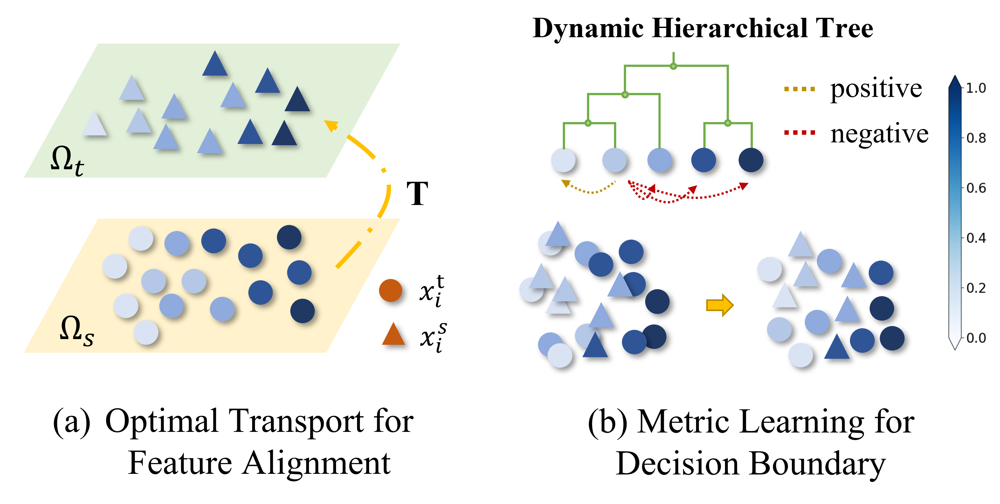

# Molecular Regression Optimal Transport (MROT)
This is the repository for <em>Improving Molecular Representation Learning with Metric Learning-enhanced Optimal Transport [[arXiv](https://arxiv.org/abs/2202.06208)].</em>  
We design an optimal-transport based algorithm to tackle the regression tasks in the molecular representation learning and 
improve the generalization capability of deep learning models. This work will be published at *Patterns*. 
<p align="center"></p>

## Environment
pytorch >=  3.8.5  
python >=  1.9.0  
 ```bash
# Install packages
pip install pytorch 
pip install einops
pip install POT
pip install kmeans-pytorch
pip install pytorch-metric-learning
pip install mendeleev rdkit-pypi
```
*Awesome packages for implementing OT:*   
- [POT](https://pythonot.github.io/index.html) (recommend)    
POT provides Machine Learning related solvers for [DA problems](https://pythonot.github.io/auto_examples/domain-adaptation).
Moreover, you can add any sort of regularization to OT such as the [Grourp Lasso](https://pythonot.github.io/quickstart.html?highlight=group%20sparsity).
A good example to add generic regularizations is available [there](https://pythonot.github.io/auto_examples/plot_optim_OTreg.html).   
Specifically, you can add the conditional gradient through [ot.optim.cg](https://pythonot.github.io/gen_modules/ot.optim.html#ot.optim.cg) 
or the generalized conditional gradient through [ot.optim.gcg](https://pythonot.github.io/gen_modules/ot.optim.html#ot.optim.gcg). 
Notebly, [ot.sinkhorn2](https://pythonot.github.io/all.html?highlight=ot%20sinkhorn2#ot.sinkhorn2) returns the loss while
 [ot.sinkhorn](https://pythonot.github.io/all.html?highlight=sinkhorn#ot.sinkhorn) does not. 


- [PyTorchOT](https://github.com/rythei/PyTorchOT)  
This supports Pytorch and is more friendly to gradient propagation. 

- [Sinkhorn-solver](https://gist.github.com/wohlert/8589045ab544082560cc5f8915cc90bd)  
A convenient solver using Pytorch and the writer only provides visualizations.  

- [OP meets ML](https://mathematical-coffees.github.io/mc01-ot/)  
A great collection of OT resources. 

*Awesome packages for implementing K-means clustering:*  
- [kmeans_pytorch](https://github.com/subhadarship/kmeans_pytorch) (recommend)       
It supports GPU usage of K-means with Pytorch.   
- [KeOps](https://www.kernel-operations.io/keops/introduction/why_using_keops.html) 
There is an excellent simple [implementation](https://www.kernel-operations.io/keops/_auto_tutorials/kmeans/plot_kmeans_torch.html)
 as well as its visualization of K-means algorithm. 

*Awesome packages for implementing metric learning:*
- [pytorch-metric-learning](https://github.com/KevinMusgrave/pytorch-metric-learning#readme) (recommend)  
It offers very straightforward and easy-to-understand APIs to plan a triplet loss. Please take care of the version of Pytorch. 

## Dataset
We examine our method across a wide range of benchmark datasets, including QM7/8/9, ESOL, FreeSolv, and Lipophilicity. Notably, 
all datasets except the adsorption dataset are open-accessed and broadly used by the AI4SCIENCE community. The adsorption 
dataset is newly collected and please cite our paper if you employ this database. 
- **QM7**  
Download (Official Website): `http://quantum-machine.org/datasets/ `  
Download (DeepChem, *recommend*): `https://github.com/deepchem/deepchem/blob/master/deepchem/molnet/load_function/qm7_datasets.py#L30-L107`  
Discription (DeepChem): `https://deepchem.readthedocs.io/en/latest/api_reference/moleculenet.html#qm7-datasets`

- **QM8**    
Download (DeepChem): `https://github.com/deepchem/deepchem/blob/master/deepchem/molnet/load_function/qm8_datasets.py`   
Discription (DeepChem): `https://deepchem.readthedocs.io/en/latest/api_reference/moleculenet.html?highlight=qm7#qm8-datasets` 


- **QM9**   
Download (Official Website): `https://ndownloader.figshare.com/files/3195389`  
Download (Atom3D, *recommend*): `https://www.atom3d.ai/smp.html`   
Download (Deep Chem): `https://github.com/deepchem/deepchem/blob/master/deepchem/molnet/load_function/qm9_datasets.py`     
Download (MPNN Supplement): `https://drive.google.com/file/d/0Bzn36Iqm8hZscHFJcVh5aC1mZFU/view?resourcekey=0-86oyPL3e3l2ZTiRpwtPDBg`   
Download (Schnet): `https://schnetpack.readthedocs.io/en/stable/tutorials/tutorial_02_qm9.html#Loading-the-data` 

- **ESOL & FreeSolv & Lipophilicity**  
Download and Description (from Moleculnet, *recommend*): `https://moleculenet.org/datasets-1`  
Download (from Glambard): `https://github.com/GLambard/Molecules_Dataset_Collection`  
Description (From Deepchem): `https://deepchem.readthedocs.io/en/latest/api_reference/moleculenet.html`    
Description (From DGL-sci): `https://lifesci.dgl.ai/api/data.html#tox21`  


- **Adsorption Dataset**  
Raw Dataset: Baidu Cloud using [This Link](https://pan.baidu.com/s/1Ex6RJkQtk5oA5wn4dsT-Jg) (passward: `8uqy`)  
Post-processed Dataset: Baidu Cloud using [This Link](https://pan.baidu.com/s/1zxWsFwuJXiaCWLn_GLzMdQ) (passward: `82kq`)  

## Baseline
We refer to some excellent implementations of baselines used in our paper.  
- [DANN](https://arxiv.org/pdf/1505.07818.pdf):   
`https://github.com/Yangyangii/DANN-pytorch`  
`https://github.com/fungtion/DANN_py3`   
`https://github.com/NaJaeMin92/pytorch_DANN`  

- [CDAN](https://arxiv.org/abs/1705.10667)  
`https://github.com/thuml/CDAN`  
`https://github.com/YBZh/CDAN-re-implement`  
`https://github.com/agrija9/Deep-Unsupervised-Domain-Adaptation`  

- [IRM](https://arxiv.org/abs/1907.02893v1)  
IRM is not used as a baseline in our experiments because we regard the whole training set as a single domain.   
`https://github.com/facebookresearch/InvariantRiskMinimization`  
`https://github.com/reiinakano/invariant-risk-minimization`  

- [MLDG](https://www.aaai.org/ocs/index.php/AAAI/AAAI18/paper/viewFile/16067/16547)  
`https://github.com/HAHA-DL/MLDG`   
`https://github.com/yogeshbalaji/Meta-Learning-Domain-Generalization/blob/master/MLDG`  

## Usage Tour
First, you need to preprocess the molecular datasets to the format of Molformer. Then call `main.py` to reproduce the results. 
For instance, if you want to implement the domain adaptation task with MROT in QM7, you can use the following comment:
```python
python main.py --data=qm7 --method=mrot
```


## Other Useful Things
[Awesome-domain-adaptation](https://github.com/zhaoxin94/awesome-domain-adaptation#optimal-transport): 
a collection of domain adaptation papers and their corresponding code.   
Proof of Wasserstein Metric: [Paper](https://www.ams.org/journals/proc/2008-136-01/S0002-9939-07-09020-X/S0002-9939-07-09020-X.pdf); 
[Lecture](https://lchizat.github.io/files2020ot/lecture3.pdf)  
Proof of Gromov-Wasserstein Metric:
 [Paper](https://media.adelaide.edu.au/acvt/Publications/2011/2011-Gromov%E2%80%93Wasserstein%20Distances%20and%20the%20Metric%20Approach%20to%20Object%20Matching.pdf);
 [Paper](https://arxiv.org/pdf/1808.04337.pdf) 

## Cite and Contact
Thanks for your time to review our code repo for MROT. If you have any sort of problems, please do not hesitate to reach out to the author `fw2359@columbia.edu`. 
We would be really appreciate it if you find our study beneficial and cite it!
```markdown
@article{wu2022metric,
  title={Metric Learning-enhanced Optimal Transport for Biochemical Regression Domain Adaptation},
  author={Wu, Fang and Courty, Nicolas and Qiang, Zhang and Li, Ziqing and others},
  journal={arXiv preprint arXiv:2202.06208},
  year={2022}
}
```


